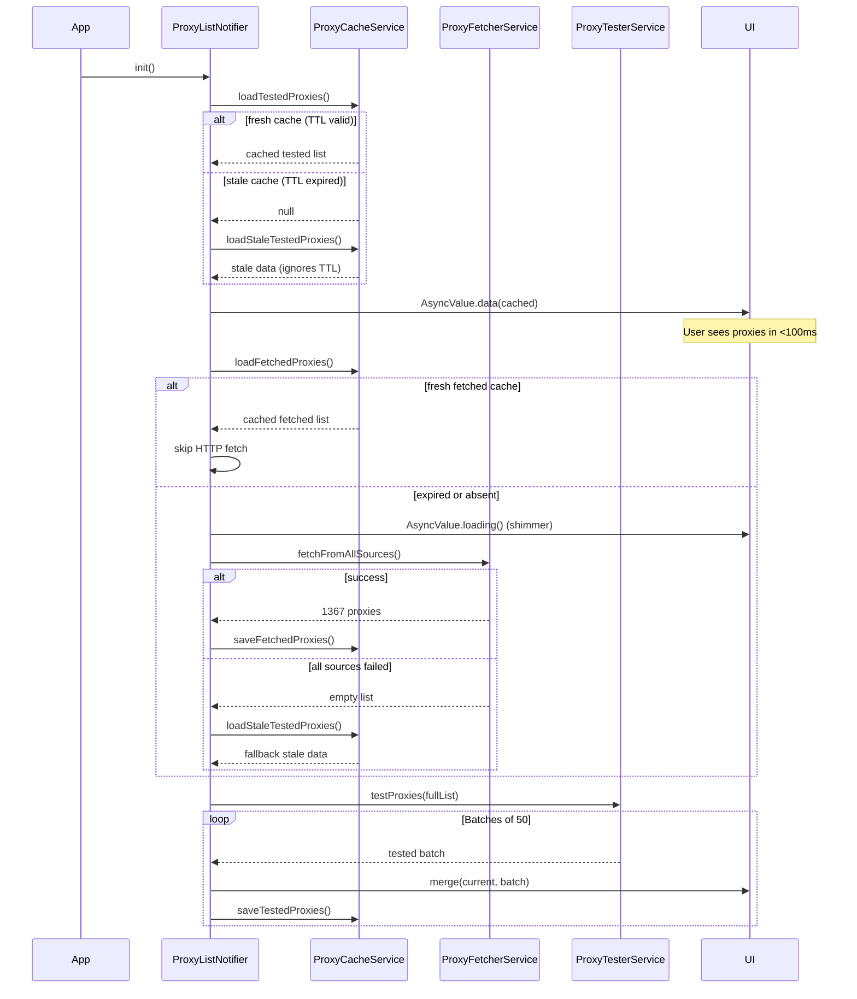
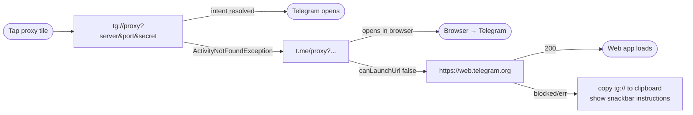

# TelePulse Architecture

## Overview

TelePulse is an Android-native MTProto proxy discovery engine. It employs a **cache-first, background-refresh** strategy: serialized proxy state loads from `SharedPreferences` in ~50ms on launch, while a parallel batch pipeline re-validates proxies in the background. All state management is handled by Riverpod's `StateNotifier` — zero code generation, fully testable.

## Why TelePulse?

Telegram's built-in proxy settings (Settings → Data & Storage → Proxy) provide a **configuration sink**: they accept a `server:port:secret` that the user must already possess. There is no discovery, no validation, no ranking.

TelePulse is a **discovery engine** that feeds Telegram's configuration sink. It solves the bootstrap problem: when Telegram is inaccessible at the network level, an independent client is required to discover a working proxy before Telegram can be launched. The `tg://` intent mechanism delivers the proxy directly — no intermediate app or copy-paste required.

## Component Diagram

```
┌────────────────────────────────────────────────────────────────────┐
│                         TelePulse App                              │
├────────────────────────────────────────────────────────────────────┤
│                                                                    │
│  ┌──────────────────────────────────────────────────────────┐     │
│  │                    UI Layer (Riverpod)                    │     │
│  │                                                           │     │
│  │  ┌──────────────┐  ┌────────────────┐  ┌──────────────┐  │     │
│  │  │  HomeScreen  │  │ ProxyListScreen │  │FavoritesScreen│  │     │
│  │  │  - dashboard │  │  - full list    │  │  - bookmarks │  │     │
│  │  │  - status orb│  │  - search/filter│  │  - empty     │  │     │
│  │  │  - top 5    │  │  - pull-refresh │  │  - retest    │  │     │
│  │  └──────┬───────┘  └────────┬───────┘  └──────┬───────┘  │     │
│  │         └──────────────────┬┘                  │           │     │
│  │                            └──────┬────────────┘           │     │
│  │                                   │                        │     │
│  │                          ┌────────▼────────┐               │     │
│  │                          │ SettingsScreen  │               │     │
│  │                          │  - custom URL   │               │     │
│  │                          │  - sources list │               │     │
│  │                          │  - stats/about  │               │     │
│  │                          └────────┬────────┘               │     │
│  └──────────────────────────────────┼─────────────────────────┘     │
│                                     │                               │
│  ┌──────────────────────────────────▼──────────────────────────┐    │
│  │                 State Layer (Riverpod)                       │    │
│  │                                                              │    │
│  │  ┌─────────────────────────────────────────────────────┐    │    │
│  │  │            ProxyListNotifier                         │    │    │
│  │  │  state: AsyncValue<List<ProxyModel>>                │    │    │
│  │  │  loadState: ProxyLoadState (enum FSM)               │    │    │
│  │  │  Guards: _isFetching, _isTesting, _disposed         │    │    │
│  │  │  Counters: _totalProxies, _testedCount              │    │    │
│  │  │                                                      │    │    │
│  │  │  +init()                                            │    │    │
│  │  │  +refreshProxies()                                  │    │    │
│  │  │  +testProxies({proxyList})                          │    │    │
│  │  │  +testSingleProxy(proxy)                            │    │    │
│  │  │  +toggleFavorite(proxy)                             │    │    │
│  │  │  +addCustomSource(url)                              │    │    │
│  │  │  +connectToProxy(proxy)                             │    │    │
│  │  └─────────────────────────────────────────────────────┘    │    │
│  └──────────────────────────┬──────────────────────────────────┘    │
│                             │                                       │
│  ┌──────────────────────────▼──────────────────────────────────┐    │
│  │                     Service Layer                            │    │
│  │                                                              │    │
│  │  ┌─────────────────────┐      ┌──────────────────────────┐  │    │
│  │  │  ProxyFetcherService│      │  ProxyTesterService      │  │    │
│  │  │  - Dio HTTP client  │      │  - dart:io Socket        │  │    │
│  │  │  - 7 prim. + 2 fb  │      │  - TCP connect 2s t/o    │  │    │
│  │  │  - retry(3) + t/o  │      │  - TLS Client Hello      │  │    │
│  │  │  - deduplication   │      │  - 50 concurrent         │  │    │
│  │  └────────┬────────────┘      └──────────┬───────────────┘  │    │
│  │           │                              │                   │    │
│  │  ┌────────▼────────────┐      ┌──────────▼───────────────┐  │    │
│  │  │  ProxyCacheService  │      │  ProxyRankerService      │  │    │
│  │  │  - SharedPrefs I/O │      │  - latency asc sort      │  │    │
│  │  │  - JSON ser/deser  │      │  - port-443 bonus +8     │  │    │
│  │  │  - TTL: 1h/24h     │      │  - source trust +10      │  │    │
│  │  │  - stale fallback  │      │  - fakeTLS secret +15    │  │    │
│  │  └─────────────────────┘      └──────────────────────────┘  │    │
│  │                                                              │    │
│  │  ┌─────────────────────┐      ┌──────────────────────────┐  │    │
│  │  │  DeepLinkService    │      │  ConnectivityService     │  │    │
│  │  │  - tg:// intent     │      │  - connectivity_plus    │  │    │
│  │  │  - t.me fallback    │      │  - edge-triggered       │  │    │
│  │  │  - clipboard copy   │      │  - auto re-test         │  │    │
│  │  │  - web fallback     │      │                          │  │    │
│  │  └─────────────────────┘      └──────────────────────────┘  │    │
│  └──────────────────────────────────────────────────────────────┘    │
└──────────────────────────────────────────────────────────────────────┘
```

## Data Flow

### App Launch Sequence



### Proxy Test Lifecycle

```mermaid
flowchart TD
    Start([Test Proxy]) --> Parse[server:port:secret]
    Parse --> Detect{protocolType?}
    Detect -->|plain| TCP[Socket.connect 2s]
    Detect -->|fakeTls| TCP
    Detect -->|ddPadding| TCP
    
    TCP -->|connected| RecordLat[Record latencyMs]
    TCP -->|SocketException| Dead[isAlive=false]
    TCP -->|Timeout 2s| Dead
    
    RecordLat --> IsTLS{secret starts with ee?}
    IsTLS -->|yes| TLS[send Client Hello<br/>wait 1s for response]
    IsTLS -->|no| Alive[isAlive=true]
    
    TLS -->|data.isNotEmpty| Alive
    TLS -->|empty/timer/error| Alive
    Note over TLS,Alive: TLS fail ≠ proxy dead<br/>MTProto may still work
    
    Dead --> Return[return ProxyModel]
    Alive --> Return
```

### Deep Link Resolution Chain



## State Machine

```
                    ┌──────────┐
                    │  initial │
                    └────┬─────┘
                         │ refreshProxies()
                    ┌────▼─────┐
          ┌─────────│ loading  │─────────┐
          │         └────┬─────┘         │
          │              │ fetch ok      │
          │         ┌────▼─────┐         │
          │         │  ready   │◄────────┘
          │         └────┬─────┘
          │              │
     ┌────▼────┐   ┌────▼─────┐   ┌──────────┐
     │  error  │   │ testing  │   │noInternet│
     └─────────┘   └────┬─────┘   └──────────┘
                        │ all batches done
                   ┌────▼─────┐
                   │  ready   │
                   └──────────┘

    Transitions:
      initial  ──► loading     (refreshProxies)
      loading  ──► ready       (fetch + test complete)
      loading  ──► error       (all 7 sources failed)
      loading  ──► noProxies   (0 proxies fetched)
      ready    ──► testing     (testProxies called)
      ready    ──► noInternet  (connectivity loss)
      testing  ──► ready       (all batches complete)
      error    ──► loading     (user taps retry)
```

## Core Models

### ProxyModel

```
┌──────────────────────────────────────┐
│             ProxyModel                │
├──────────────────────────────────────┤
│  Fields:                             │
│    server: String                     │
│    port: int                          │
│    secret: String                     │
│    source: String                     │
│    latencyMs: int                     │
│    isAlive: bool                      │
│    isFavorite: bool                   │
│    lastChecked: DateTime?            │
│    protocolType: ProxyProtocolType    │
│      ├── plain                        │
│      ├── fakeTls (secret starts ee)   │
│      ├── ddPadding (secret starts dd) │
│      └── unknown                      │
├──────────────────────────────────────┤
│  Computed:                           │
│    isFakeTls: bool                    │
│    proxyLink: String  (tg://)        │
│    tmeLink: String   (t.me/proxy)    │
│    displayServer: String (max 24ch)  │
├──────────────────────────────────────┤
│  Serialization:                      │
│    toJson() → Map<String, dynamic>   │
│    fromJson(Map) → ProxyModel       │
│    hashCode → Object.hash(server,    │
│                          port,       │
│                          secret)     │
└──────────────────────────────────────┘
```

### ProxyLoadState

```
enum ProxyLoadState {
  initial,      // app launched, nothing loaded
  loading,      // fetching from network sources
  ready,        // proxies available in state
  error,        // all 7 sources failed
  noInternet,   // device is offline
  noProxies,    // 0 proxies from all sources
  testing,      // batch validation in progress
}
```

## Source Architecture

```
ProxyFetcherService.fetchFromAllSources()
│
├── Primary (parallel Dio GET, 10s connect / 15s receive)
│   ├── SoliSpirit          weight=5
│   ├── kort0881-all        weight=5
│   ├── kort0881-eu         weight=4
│   ├── kort0881-ru         weight=4
│   ├── Grim1313            weight=5
│   ├── iwh3n               weight=3
│   └── ALIILAPRO           weight=3
│
├── Fallback (if primary < 50 proxies)
│   ├── SoliSpirit-mirror   weight=2  (CDN)
│   └── Grim1313-HTML       weight=2  (HTML parse)
│
└── Dedup (by server:port:secret)
```

Source health provider: auto-disables after 3 failures, recovers after 30 minutes.

## Key Architecture Decisions

| Decision | Rationale |
|---|---|
| `dart:io` Socket (not HTTP) | Direct TCP connect; no HTTP overhead; works offline |
| Riverpod StateNotifier | Lightweight; no code generation; explicit transitions |
| SharedPreferences (not SQLite) | Proxy data is flat JSON — relational semantics add no value |
| 50 concurrent sockets | Optimal for mobile ARM64; 100+ causes `EMFILE` on some kernels |
| Batch merge (not replace) | Cache-first invariant: known-working proxies stay visible until explicitly re-tested |
| Socket reuse for TLS | Fake-TLS handshake reuses the TCP socket from `testProxy()` — saves 2s per proxy |
| Direct `tg://` (skip `canLaunchUrl`) | `canLaunchUrl` on Android 11+ returns false negatives for deep intents |
| 2s connect timeout | Median MTProto proxy responds in 400-800ms; 2s captures ~95% of legit proxies |
| 1h fetched / 24h tested TTL | Sources update frequently; tested results are valid longer |
| Stale cache fallback | If TTL expired but no network, show stale data rather than blank |

## File Tree

```
lib/
├── main.dart                        # Entry: WidgetsFlutterBinding + ProviderScope
├── app.dart                         # MainShell: IndexedStack + NavigationBar + 4 tabs
├── models/
│   └── proxy_model.dart             # ProxyModel + protocol detection + JSON
├── data/
│   └── proxy_sources.dart           # 9 source definitions (7 primary + 2 fallback)
├── services/
│   ├── proxy_fetcher_service.dart   # HTTP fetch via Dio + 4 parser strategies
│   ├── proxy_tester_service.dart    # Socket.connect + TLS handshake + batching
│   ├── proxy_ranker_service.dart    # Score-based sorting + top-N selection
│   ├── proxy_cache_service.dart     # SharedPreferences 2-layer cache with TTL
│   ├── proxy_source_provider.dart   # Per-source health tracking + auto-disable
│   ├── connectivity_service.dart    # connectivity_plus edge-triggered wrapper
│   └── deep_link_service.dart       # tg:// → t.me → web → clipboard chain
├── providers/
│   └── proxy_list_provider.dart     # Central StateNotifier + FSM + merge logic
├── screens/
│   ├── home_screen.dart             # Dashboard: status orb, SCANNING badge, top 5
│   ├── proxy_list_screen.dart       # Full list: testing progress, popup menu
│   ├── favorites_screen.dart        # Bookmarks: empty state, pull-to-retest
│   └── settings_screen.dart         # Custom URL, sources table, stats, about
├── widgets/
│   ├── proxy_tile.dart              # Card: tap → tg://, long-press → clipboard
│   ├── animated_status_orb.dart     # CustomPainter: dash-ring + pulse + glow
│   ├── status_badge.dart            # Color-coded latency badge
│   ├── glass_card.dart              # Semi-transparent surface container
│   └── proxy_shimmer.dart           # Shimmer loading skeleton
├── theme/
│   └── app_theme.dart               # Dark M3 color scheme + terminalGreen
└── utils/
    └── haptic_utils.dart            # HapticFeedback patterns
```

## Performance Budget

| Operation | Target | Actual |
|---|---|---|
| Cache load (tested) | <100ms | ~50ms |
| Cache load (fetched) | <200ms | ~80ms |
| Full fetch (7 sources) | <15s | 5-10s |
| Full test (1367 proxies) | <60s | ~55s |
| Incremental UI update | <50ms | ~20ms |
| Cold start → proxy visible | <3s | ~1.5s |
| Warm start → cached proxy | <0.5s | ~100ms |
