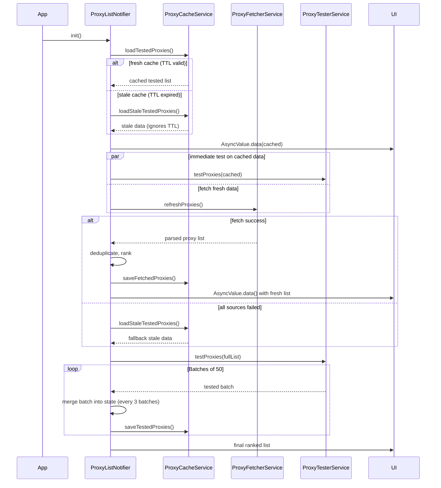
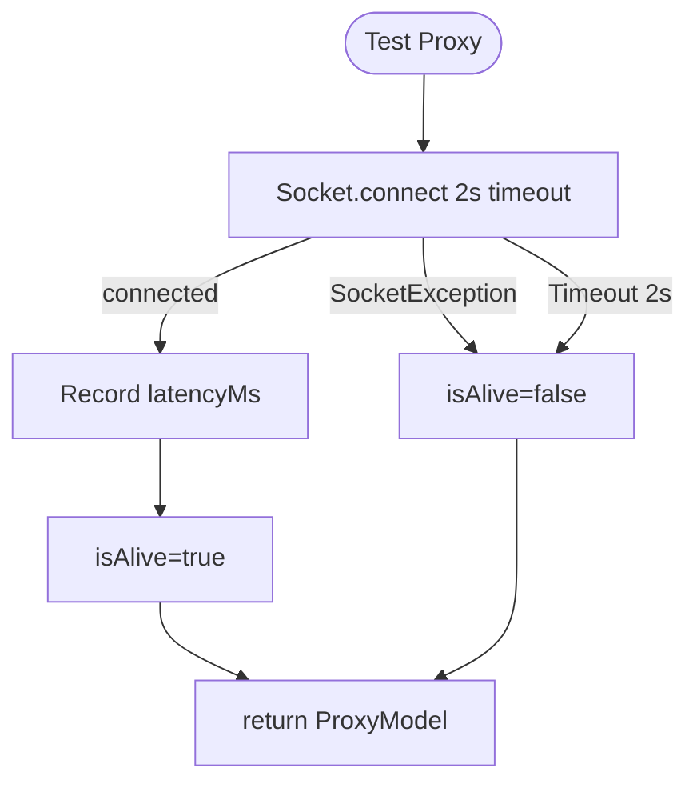
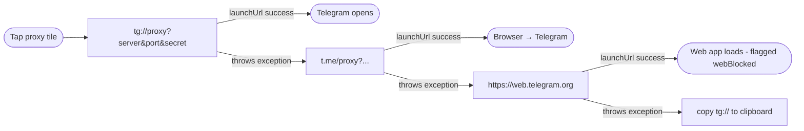

# TelePulse Architecture

## Overview

TelePulse is an Android-native MTProto proxy discovery engine. It employs a **cache-first, background-refresh** strategy: serialized proxy state loads from `SharedPreferences` in ~50ms on launch, while a parallel batch pipeline re-validates proxies in the background. All state management is handled by Riverpod's `StateNotifier` — zero code generation, fully testable.

## Why TelePulse?

Telegram's built-in proxy settings (Settings → Data & Storage → Proxy) provide a **configuration sink**: they accept a `server:port:secret` that the user must already possess. There is no discovery, no validation, no ranking.

TelePulse is a **discovery engine** that feeds Telegram's configuration sink. It solves the bootstrap problem: when Telegram is inaccessible at the network level, an independent client is required to discover a working proxy before Telegram can be launched. The `tg://` intent mechanism delivers the proxy directly — no intermediate app or copy-paste required.

## Component Diagram

```
┌────────────────────────────────────────────────────────────────────┐
│                         TelePulse App                              │
├────────────────────────────────────────────────────────────────────┤
│                                                                    │
│  ┌──────────────────────────────────────────────────────────┐     │
│  │                    UI Layer (Riverpod)                    │     │
│  │                                                           │     │
│  │  ┌──────────────┐  ┌────────────────┐  ┌──────────────┐  │     │
│  │  │  HomeScreen  │  │ ProxyListScreen │  │FavoritesScreen│  │     │
│  │  │  - dashboard │  │  - full list    │  │  - bookmarks │  │     │
│  │  │  - status orb│  │  - search/filter│  │  - empty     │  │     │
│  │  │  - top 5    │  │  - pull-refresh │  │  - retest    │  │     │
│  │  └──────┬───────┘  └────────┬───────┘  └──────┬───────┘  │     │
│  │         └──────────────────┬┘                  │           │     │
│  │                            └──────┬────────────┘           │     │
│  │                                   │                        │     │
│  │                          ┌────────▼────────┐               │     │
│  │                          │ SettingsScreen  │               │     │
│  │                          │  - custom URL   │               │     │
│  │                          │  - sources list │               │     │
│  │                          │  - stats/about  │               │     │
│  │                          │  - update check │               │     │
│  │                          └────────┬────────┘               │     │
│  └──────────────────────────────────┼─────────────────────────┘     │
│                                     │                               │
│  ┌──────────────────────────────────▼──────────────────────────┐    │
│  │                 State Layer (Riverpod)                       │    │
│  │                                                              │    │
│  │  ┌─────────────────────────────────────────────────────┐    │    │
│  │  │            ProxyListNotifier                         │    │    │
│  │  │  state: AsyncValue<List<ProxyModel>>                │    │    │
│  │  │  loadState: ProxyLoadState (enum FSM)               │    │    │
│  │  │  Guards: _isFetching, _isTesting, _disposed         │    │    │
│  │  │  Counters: _totalProxies, _testedCount              │    │    │
│  │  │  Computed: aliveCount, avgLatency, alivePercent     │    │    │
│  │  │                                                      │    │    │
│  │  │  +init()                                            │    │    │
│  │  │  +refreshProxies()                                  │    │    │
│  │  │  +testProxies({proxyList})                          │    │    │
│  │  │  +testSingleProxy(proxy)                            │    │    │
│  │  │  +didTapProxy(proxy)                                │    │    │
│  │  │  +connectToProxy(proxy)                             │    │    │
│  │  │  +toggleFavorite(proxy)                             │    │    │
│  │  │  +addCustomSource(url)                              │    │    │
│  │  └─────────────────────────────────────────────────────┘    │    │
│  └──────────────────────────┬──────────────────────────────────┘    │
│                             │                                       │
│  ┌──────────────────────────▼──────────────────────────────────┐    │
│  │                     Service Layer                            │    │
│  │                                                              │    │
│  │  ┌─────────────────────┐      ┌──────────────────────────┐  │    │
│  │  │  ProxyFetcherService│      │  ProxyTesterService      │  │    │
│  │  │  - Dio HTTP client  │      │  - dart:io Socket        │  │    │
│  │  │  - 7 source entries │      │  - TCP connect 2s t/o    │  │    │
│  │  │  - retry(3) + t/o   │      │  - 50 concurrent         │  │    │
│  │  │  - dedup O(n)       │      │  - no protocol handshake │  │    │
│  │  └────────┬────────────┘      └──────────┬───────────────┘  │    │
│  │           │                              │                   │    │
│  │  ┌────────▼────────────┐      ┌──────────▼───────────────┐  │    │
│  │  │  ProxyCacheService  │      │  ProxyRankerService      │  │    │
│  │  │  - SharedPrefs I/O │      │  - score-based ranking   │  │    │
│  │  │  - JSON ser/deser  │      │  - port-443 bonus +8     │  │    │
│  │  │  - TTL: 1h/24h     │      │  - source trust +10      │  │    │
│  │  │  - stale fallback  │      │  - ee/dd secret +15/+5   │  │    │
│  │  └─────────────────────┘      │  - fail penalty −50/ea  │  │    │
│  │                              └──────────────────────────┘  │    │
│  │  ┌─────────────────────┐      ┌──────────────────────────┐  │    │
│  │  │  DeepLinkService    │      │  ConnectivityService     │  │    │
│  │  │  - tg:// intent     │      │  - connectivity_plus    │  │    │
│  │  │  - t.me fallback    │      │  - edge-triggered       │  │    │
│  │  │  - web fallback     │      │  - auto re-test         │  │    │
│  │  │  - clipboard copy   │      │                          │  │    │
│  │  └─────────────────────┘      └──────────────────────────┘  │    │
│  │                                                              │    │
│  │  ┌──────────────────────────────────────────────────────┐    │    │
│  │  │              UpdateService                           │    │    │
│  │  │  - GitHub Releases API lookup                       │    │    │
│  │  │  - Semver comparison                                │    │    │
│  │  │  - 1h cache + skip-version persistence              │    │    │
│  │  │  - APK download URL resolution                      │    │    │
│  │  └──────────────────────────────────────────────────────┘    │    │
│  │                                                              │    │
│  │  ┌──────────────────────────────────────────────────────┐    │    │
│  │  │              ProxySourceProvider                     │    │    │
│  │  │  - per-source health tracking                        │    │    │
│  │  │  - auto-disable after 3 failures                     │    │    │
│  │  │  - 30 min recovery window                            │    │    │
│  │  │  - fallback source ordering                          │    │    │
│  │  └──────────────────────────────────────────────────────┘    │    │
│  └──────────────────────────────────────────────────────────────┘    │
└──────────────────────────────────────────────────────────────────────┘
```

## Data Flow

### App Launch Sequence



### Proxy Test Lifecycle



### User Tap Flow (Failure Feedback)

```mermaid
flowchart TD
    Tap([User taps proxy tile])
    Tap --> DidTap[didTapProxy: failures++]
    DidTap --> Test[testSingleProxy: TCP connect]
    Test --> Connect[connectToProxy: tg:// intent]
    Connect -->|Telegram opens| NoChange([Proxy works])
    Connect -->|Telegram stuck "Connecting"| NextTap([User returns, taps another])
    NextTap --> DidTap
```

### Deep Link Resolution Chain



## State Machine

```
                    ┌──────────┐
                    │  initial │
                    └────┬─────┘
                         │ refreshProxies()
                    ┌────▼─────┐
          ┌─────────│ loading  │─────────┐
          │         └────┬─────┘         │
          │              │ fetch ok      │
          │         ┌────▼─────┐         │
          │         │  ready   │◄────────┤
          │         └────┬─────┘         │
          │              │               │
     ┌────▼────┐   ┌────▼─────┐   ┌──────▼─────┐
     │  error  │   │ testing  │   │ noInternet │
     └─────────┘   └────┬─────┘   └────────────┘
                        │ all batches done
                   ┌────▼─────┐
                   │  ready   │
                   └──────────┘

    Transitions:
      initial   ──► loading     (refreshProxies)
      loading   ──► ready       (fetch complete)
      loading   ──► error       (all sources failed)
      loading   ──► noProxies   (0 proxies fetched)
      ready     ──► testing     (testProxies called)
      ready     ──► noInternet  (connectivity loss)
      testing   ──► ready       (all batches complete)
      error     ──► loading     (user taps retry)
      noInternet ─► loading     (connectivity restored)
```

## Core Models

### ProxyModel

```
┌──────────────────────────────────────────┐
│              ProxyModel                   │
├──────────────────────────────────────────┤
│  Fields:                                 │
│    server: String                         │
│    port: int                              │
│    secret: String                         │
│    source: String                         │
│    latencyMs: int                         │
│    isAlive: bool                          │
│    isFavorite: bool                       │
│    lastChecked: DateTime?                │
│    connectionFailures: int                │
│      (incremented each user tap,          │
│       reset when TCP re-test passes)      │
│    protocolType: ProxyProtocolType        │
│      ├── plain                            │
│      ├── fakeTls (secret starts ee)       │
│      └── ddPadding (secret starts dd)     │
├──────────────────────────────────────────┤
│  Computed:                               │
│    isFakeTls: bool                        │
│    proxyLink: String  (tg://)            │
│    tmeLink: String   (t.me/proxy)        │
│    displayServer: String (max 24ch)      │
├──────────────────────────────────────────┤
│  Serialization:                          │
│    toJson() → Map<String, dynamic>       │
│    fromJson(Map) → ProxyModel           │
│    hashCode → Object.hash(server,        │
│                          port,           │
│                          secret)          │
└──────────────────────────────────────────┘
```

### ProxyLoadState

```dart
enum ProxyLoadState {
  initial,      // app launched, nothing loaded
  loading,      // fetching from network sources
  testing,      // batch validation in progress
  ready,        // proxies available in state
  error,        // all sources failed
  noInternet,   // device is offline
  noProxies,    // 0 proxies from all sources
}
```

## Source Architecture

```
ProxySourceProvider.getActiveSources()
│
├── 7 source entries (parallel Dio GET, 10s connect / 15s receive)
│   ├── SoliSpirit          weight=5  (primary)
│   ├── kort0881-all        weight=5  (primary, all regions)
│   ├── kort0881-eu         weight=4  (primary, EU only)
│   ├── kort0881-ru         weight=4  (primary, RU only)
│   ├── Grim1313            weight=5  (primary, community fork)
│   ├── iwh3n               weight=3  (secondary)
│   └── ALIILAPRO           weight=3  (secondary)
│
├── Fallback (if primary < 50 proxies)
│   ├── SoliSpirit-mirror   weight=2  (CDN)
│   └── Grim1313-HTML       weight=2  (HTML parse)
│
└── Dedup (by server:port:secret)
```

Source health provider: auto-disables after 3 failures, recovers after 30 minutes.

## Ranking Algorithm

ProxyRankerService calculates a composite score per proxy:

| Factor | Value | Rationale |
|---|---|---|
| TCP alive | +100 | Base score for responding proxies |
| Connection failures < 3 | Required for topProxies() | Users report dead proxies |
| Latency < 100ms | +50 | Best responsiveness |
| Latency 100-299ms | +40 | Good |
| Latency 300-499ms | +25 | Acceptable |
| Latency 500-999ms | +10 | Slow but usable |
| Source trust (SoliSpirit/kort0881/Grim1313) | +10 | Higher reliability sources |
| FakeTLS secret (ee prefix) | +15 | Less likely to be throttled |
| Obfuscated secret (dd prefix) | +5 | Light obfuscation |
| Port 443 | +8 | Mimics HTTPS traffic |
| Per connection failure | −50 | User feedback penalty |
| Max failures for top ranking | 3 | Proxies with ≥3 failures excluded |

## Key Architecture Decisions

| Decision | Rationale |
|---|---|
| `dart:io` Socket (not HTTP) | Direct TCP connect; no HTTP overhead; works offline |
| **TCP-only testing** (no protocol handshake) | FakeTLS and obfuscation handshakes caused false positives/negatives across diverse proxy implementations; TCP connect alone is the only reliable signal |
| User feedback as primary ranking signal | Technical testing can't predict Telegram's server-side behavior; `connectionFailures` from actual taps dominate the score |
| Riverpod StateNotifier | Lightweight; no code generation; explicit transitions |
| SharedPreferences (not SQLite) | Proxy data is flat JSON — relational semantics add no value |
| 50 concurrent sockets | Optimal for mobile ARM64; 100+ causes `EMFILE` on some kernels |
| Batch merge (not replace) | Cache-first invariant: known-working proxies stay visible until explicitly re-tested |
| Direct `tg://` (skip `canLaunchUrl`) | `canLaunchUrl` on Android 11+ returns false negatives for deep intents |
| 2s connect timeout | Median MTProto proxy responds in 400-800ms; 2s captures ~95% of legit proxies |
| 1h fetched / 24h tested TTL | Sources update frequently; tested results are valid longer |
| Stale cache fallback | If TTL expired but no network, show stale data rather than blank |
| Throttled state updates (every 3 batches) | Reduces widget rebuild churn from 50 per full test to ~3 |
| Immediate test on cached load | Without cache, user waits for fetch + test (15-30s); with cache, results appear in seconds |

## File Tree

```
lib/
├── main.dart                        # Entry: WidgetsFlutterBinding + ProviderScope
├── app.dart                         # MainShell: IndexedStack + NavigationBar + 4 tabs
├── models/
│   └── proxy_model.dart             # ProxyModel + protocol detection + JSON ser/deser
├── data/
│   └── proxy_sources.dart           # 7 source definitions + 2 fallback
├── services/
│   ├── proxy_fetcher_service.dart   # HTTP fetch via Dio + 4 parser strategies
│   ├── proxy_tester_service.dart    # Socket.connect 2s, 50 concurrent, no handshake
│   ├── proxy_ranker_service.dart    # Score-based ranking + failure penalty + top-N
│   ├── proxy_cache_service.dart     # SharedPreferences 2-layer cache with TTL
│   ├── proxy_source_provider.dart   # Per-source health tracking + auto-disable
│   ├── connectivity_service.dart    # connectivity_plus edge-triggered wrapper
│   ├── deep_link_service.dart       # tg:// → t.me → web → clipboard chain
│   └── update_service.dart          # GitHub API update check + caching
├── providers/
│   └── proxy_list_provider.dart     # Central StateNotifier + FSM + merge + failure feedback
├── screens/
│   ├── home_screen.dart             # Dashboard: status orb, top 5, fade animations
│   ├── proxy_list_screen.dart       # Full list: testing progress bar, re-test button
│   ├── favorites_screen.dart        # Bookmarks: empty state, pull-to-retest
│   └── settings_screen.dart         # Custom URL, sources, stats, about, updates
├── widgets/
│   ├── proxy_tile.dart              # Card: tap → didTap + test + connect, long-press → clipboard
│   ├── animated_status_orb.dart     # CustomPainter: dash-ring + scan arc + pulse
│   ├── status_badge.dart            # Color-coded latency badge (alive/warn/dead)
│   ├── glass_card.dart              # Semi-transparent surface container
│   └── proxy_shimmer.dart           # Shimmer loading skeleton with tile placeholders
├── theme/
│   └── app_theme.dart               # Dark M3 color scheme + terminal green + custom cards
└── utils/
    └── haptic_utils.dart            # HapticFeedback patterns (light, selection, success, error)
```

## Performance Budget

| Phase | Latency | Notes |
|---|---|---|
| Cache load (tested) | ~50ms | From SharedPreferences |
| Full fetch | 5-10s | Parallel HTTP requests |
| Full test (200 proxies) | ~8s | 2s connect ÷ 50 concurrency |
| Incremental update | per 3 batches (~6s) | Throttled state merge |
| App cold start to ready | ~1s | Cache-first rendering |
| Tap → Telegram dialog | ~500ms | didTapProxy + TCP test + tg:// intent |
