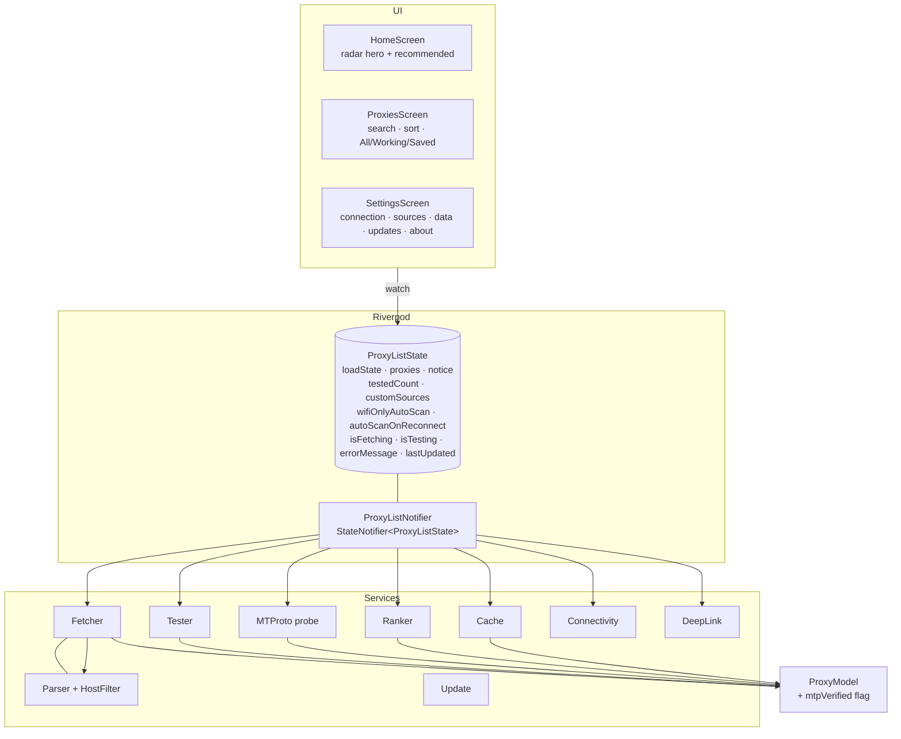
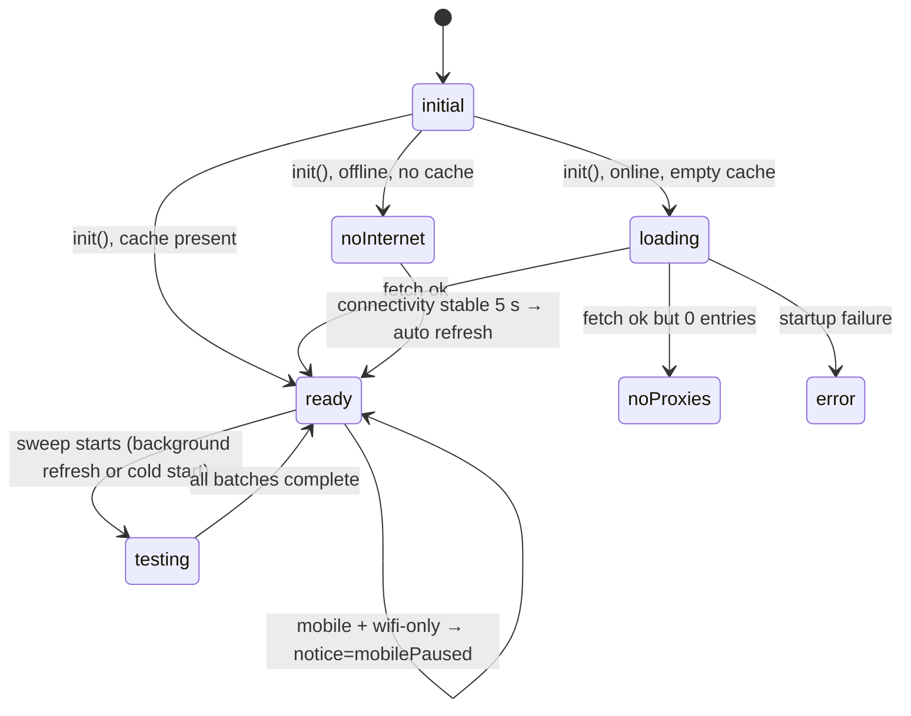
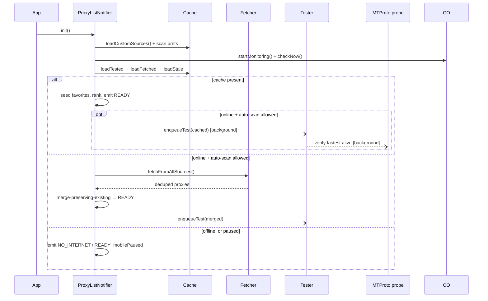
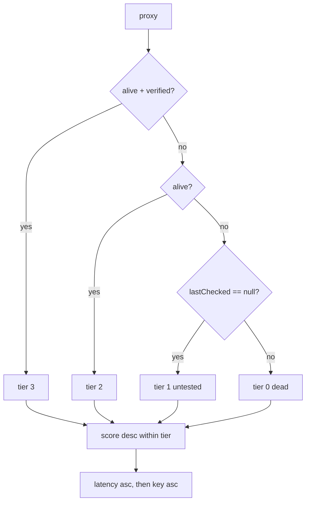

# TelePulse Architecture

> v0.1.0 · Android · Flutter 3.44 · Dart 3.12 · Riverpod 2.6 · 282 tests green
>
> This document describes the system **as it is implemented** — every claim here is backed by code and covered by the test suite.

## 1. Overview

TelePulse is a **discovery engine**, not a proxy client. It fetches MTProto proxy lists from independent sources, TCP-validates them, **handshake-verifies** the survivors against real Telegram DCs, ranks them, and hands the winner to Telegram via `tg://` deep links. It never routes traffic, has no backend of its own, and stores nothing outside the device.

Design pillars:

1. **Cache-first** — persisted results render in milliseconds; network work happens in the background.
2. **Single observable state object** — one `ProxyListState` drives every screen; no hidden non-reactive flags.
3. **Proof beats reachability** — a proxy that completes an MTProto handshake outranks one that merely answers TCP.
4. **Confirmed-failure feedback only** — penalties are applied after a test proves a proxy dead, never on exploration or timeouts.
5. **Hardened inputs** — every byte from the network is treated as hostile until validated.

## 2. Layer map


```mermaid
flowchart TB
    subgraph UI
        H[HomeScreen<br/>radar hero + recommended]
        P[ProxiesScreen<br/>search · sort · All/Working/Saved]
        S[SettingsScreen<br/>connection · sources · data · updates · about]
    end

    subgraph State["Riverpod"]
        N[ProxyListNotifier<br/>StateNotifier&lt;ProxyListState&gt;]
        ST[(ProxyListState<br/>loadState · proxies · notice<br/>testedCount · customSources<br/>wifiOnlyAutoScan · autoScanOnReconnect<br/>isFetching · isTesting · errorMessage · lastUpdated)]
    end

    subgraph Services
        F[Fetcher] --- PR[Parser + HostFilter]
        T[Tester]
        MP[MTProto probe]
        R[Ranker]
        C[Cache]
        CO[Connectivity]
        DL[DeepLink]
        UP[Update]
    end

    M[ProxyModel<br/>+ mtpVerified flag]

    UI -->|watch| ST
    ST --- N
    N --> F & T & MP & R & C & CO & DL
    F --> PR
    F & T & MP & R & C --> M
```

## 3. State machine (observable)

`ProxyLoadState` lives **inside** `ProxyListState`, so every transition rebuilds the UI automatically. There are no hidden getters sampled at build time.


```mermaid
stateDiagram-v2
    [*] --> initial
    initial --> loading: init(), online, empty cache
    initial --> ready: init(), cache present
    initial --> noInternet: init(), offline, no cache

    loading --> ready: fetch ok
    loading --> noProxies: fetch ok but 0 entries
    loading --> error: startup failure

    ready --> testing: sweep starts (background refresh or cold start)
    testing --> ready: all batches complete
    ready --> ready: verify pass upgrades badges live (tier 3)
    ready --> ready: manual single retest updates one entry (no testing state)

    ready --> ready: refresh failed → notice=refreshFailed (list kept)
    ready --> ready: mobile + wifi-only → notice=mobilePaused
    noInternet --> ready: connectivity stable 5 s → auto refresh
```

Soft signals ride along as `NoticeKind { none, offline, staleCache, refreshFailed, mobilePaused }` and render as banners on both list screens — an offline user sees cached data *plus* why it may be stale.

Two persisted scan preferences gate **automatic** sweeps only — manual refresh always runs:

| Flag | Default | Effect |
|---|---|---|
| `wifiOnlyAutoScan` | off | auto sweeps run on Wi-Fi/Ethernet only; mobile shows `mobilePaused` |
| `autoScanOnReconnect` | on | reconnect triggers a refresh at all |

### Failure policy (explicit two-tier)

- Background sweeps **preserve** `connectionFailures` (never increment) and reset to 0 on success — flaky networks must not mass-punish the list.
- Manual retests (`Test again`, post-tap verify) **+1 on conclusively dead**, reset to 0 on alive, unchanged on timeout/exception (inconclusive ≠ dead).
- `topProxies` excludes `failures >= 3`, so the threshold is reachable only through repeated manual confirmation.

### Guarantees enforced by tests

| Guarantee | Where tested |
|---|---|
| Offline launch shows cache without touching it | `proxy_list_notifier_test.dart › startup › offline launch with cache shows results without testing or overwriting` |
| Successful re-test resets `connectionFailures` to 0 | `proxy_list_notifier_test.dart › failure accounting › REGRESSION: successful re-test resets connectionFailures to zero` |
| Dead re-test increments by exactly 1 | `proxy_list_notifier_test.dart › failure accounting › confirmed dead re-test increments failures by one` |
| Throwing tester penalizes nothing | `proxy_concurrency_test.dart › failure policy › tester throwing counts as inconclusive — no penalty applied` |
| Favorites survive refreshes absent upstream | `proxy_list_notifier_test.dart › favorites › survive a refresh even when absent from fetched sources` |
| Favorite toggles survive mid-sweep both ways | `proxy_concurrency_test.dart › mid-sweep concurrency › favorite ON/OFF mid-sweep survives subsequent batch emissions` |
| Listener emissions are never swallowed | `proxy_concurrency_test.dart › listener integrity › toggleFavorite emits a state change to listeners` |
| Refresh failure keeps list + raises soft notice | `proxy_list_notifier_test.dart › merge semantics › refresh failure keeps existing list and raises soft notice` |
| Mid-sweep refresh keeps newcomers | `proxy_concurrency_test.dart › mid-sweep concurrency › refresh completing mid-sweep keeps fetched newcomers` |
| Pending work unions, never displaces | `proxy_concurrency_test.dart › mid-sweep concurrency › multiple enqueues during one sweep union instead of displacing` |
| All-dead sweeps don't overwrite a previously-alive cache | `proxy_concurrency_test.dart › persistence guards › all-dead sweep does not overwrite a previously-alive cache` |
| Verified proxies float first | `proxy_concurrency_test.dart › handshake verification › verified proxies are flagged and re-ranked first` |
| Verify budget capped + stale passes abort | `proxy_concurrency_test.dart › handshake verification › verification is capped per sweep` · `proxy_verify_guards_test.dart › verifyTopCandidates guards › stale verify pass aborts without touching new state` |
| Wi-Fi-only blocks auto-sweep, allows manual | `proxy_list_notifier_test.dart › scan preferences › wifi-only blocks auto-sweep on mobile with a paused notice` |

## 4. Data flow — launch


```mermaid
sequenceDiagram
    participant App
    participant N as ProxyListNotifier
    participant C as Cache
    participant F as Fetcher
    participant T as Tester
    participant MP as MTProto probe

    App->>N: init()
    N->>C: loadCustomSources() + scan prefs
    N->>CO: startMonitoring() + checkNow()
    N->>C: loadTested → loadFetched → loadStale
    alt cache present
        N->>N: seed favorites, rank, emit READY
        opt online + auto-scan allowed
            N--)T: enqueueTest(cached) [background]
            T--)MP: verify fastest alive [background]
        end
    else online + auto-scan allowed
        N->>F: fetchFromAllSources()
        F-->>N: deduped proxies
        N->>N: merge-preserving-existing → READY
        N--)T: enqueueTest(merged)
    else offline, or paused
        N->>N: emit NO_INTERNET / READY+mobilePaused
    end
```

### Refresh = merge, never replace

`mergePreservingExisting(existing, incoming)` keys by `server:port:secret`, keeps every existing entry (with its latency/failure/favorite/verified state) and appends newcomers.

### Test queue, not test drops

If a sweep is running and new work arrives, proxies accumulate into a key-deduplicated pending set drained when the sweep finishes. A reconnect arriving mid-sweep parks a `_pendingReconnect` flag drained the same way — manual and automatic intents are tracked separately so neither starves the other.

## 5. Validation pipeline

```mermaid
flowchart LR
    A[input list] --> B[shuffle]
    B --> C[batch size =<br/>adaptive concurrency]
    C --> D[per-socket stagger:<br/>i×8 ms + 0–12 ms jitter]
    D --> E[TCP connect ≤ 2 s<br/>envelope 4 s]
    E --> F[merge ONLY test fields<br/>+ OR-heal favorites]
    F --> G{more batches?}
    G -->|yes| C
    G -->|no| H[persist unless<br/>all-dead over alive]
    H --> V[verify fastest alive - max 40/sweep (10 metered), 6-way]
    V --> R[flag verified<br/>re-rank live]
```

### Stage 1 — TCP sweep

Key decisions:

- **TCP-only first pass.** Cheap and wide; proves reachability, nothing more — docs never claim otherwise.
- **Adaptive concurrency**: Wi-Fi/Ethernet → 50, mobile/VPN/bluetooth/none/other/satellite → 12 (`concurrencyFor`).
- **Staggered opens**: spreads the SYN burst so a scan doesn't look like a scan.
- **Shuffle before batching**: kills source-order bias.
- **Private-range guard** (`HostFilter`): literal IPs checked directly; hostnames resolved via DNS (5 s cap, 60 s in-memory cache for success/empty/blocked answers, 10 s on socket errors) and *every* answer must be public, then sockets connect to a vetted address (no re-resolution). Blocks loopback, RFC1918, CGNAT 100.64/10, link-local, ULA, multicast/reserved, IPv4-mapped IPv6, benchmark + TEST-NET ranges, documentation/6to4/Teredo/transition IPv6 prefixes.

### Stage 2 — MTProto handshake probe

After each sweep, the fastest TCP-alive proxies are verified with a **real obfuscated2 handshake** per the official transport spec, in pure Dart (`pointycastle` AES-256-CTR + SHA-256):

```
init      := 56 random + 0xdddddddd + dc(2) + 2 random   (64 B, rejection-sampled)
encKey    := SHA256(init[8:40] + secret)     decKey := SHA256(rev[8:40] + secret)
finalInit := init[0:56] + CTR(init)[56:64]   → send
frame     := len + req_pq_multi(nonce) + pad → CTR-continue → send
read      → decrypt → resPQ + echoed nonce?  → VERIFIED
```

- Secrets: 16-byte hex accepted; `dd`-prefixed 17-byte stripped to key bytes; `ee…` (FakeTLS) and malformed shapes return `unsupported` **without touching the network**.
- Budgets: 2.5 s connect, 5 s read deadline, 7 s all-inclusive envelope, 512 B response bound on the verified payload (DoS cap; legacy 1 MiB constant kept for compat), quick-ack bit fails closed to `dead`; every path fail-closed to `dead`.
- Scheduling: fastest-first, verifiable-secrets-first, max 40 per sweep (10 on metered), 6-way concurrency, plus a small re-verification quota so badges expire instead of going stale.
- FakeTLS handshake probing is the explicit next step (different disguise protocol).

## 6. Ranking algorithm


```mermaid
flowchart TD
    A[proxy] --> B{alive + verified?}
    B -->|yes| T3[tier 3]
    B -->|no| C{alive?}
    C -->|yes| T2[tier 2]
    C -->|no| D{lastChecked == null?}
    D -->|yes| T1[tier 1 untested]
    D -->|no| T0[tier 0 dead]
    T3 & T2 & T1 & T0 --> S[score desc within tier]
    S --> L[latency asc, then key asc]
```

`score = alive?100 + latencyTier + weight×2 + protocolBonus + port443Bonus − 50×min(failures,10)`

Trust weights come from the single source registry (`ProxySources.trustBonusFor`) — no parallel hard-coded table to drift out of sync. Protocol bonuses (`ee` +15, `dd` +5) are anti-censorship heuristics, and secrets must be hex on every parse path so malformed entries can't farm them.

## 7. Persistence layer

| Key (tp_v2_*) | Contents | TTL | Notes |
|---|---|---|---|
| `tested_proxies` + `tested_at` | ranked results | 24 h | capped at 2000 (favorites kept first); stale fallback accepted up to 7 days (`staleGrace`), then ignored |
| `fetched_proxies` + `fetched_at` | raw fetch | 1 h | used when tested cache missing/expired |
| `favorites` | favorite snapshots | ∞ | independent store; restored favorites must re-verify |
| `custom_sources` | user URLs | ∞ | HTTPS-only, survives cache clears |
| `wifi_only` / `autoscan` | scan preferences | ∞ | gate automatic sweeps; manual refresh always runs |
| `update_payload` + `update_checked_at` | latest release info | 1 h | re-validated against trust tier on load |
| `update_uptodate_version` / `update_skip_version` | update bookkeeping | ∞ | per-version suppression |

Writes are debounced (400 ms) and coalesced for tested/fetched lists; favorites write immediately. All writes are serialized and generation-guarded against clear-races; JSON **decoding** runs inside `Isolate.run` while encoding happens on the calling isolate before the async write. Corrupt JSON degrades to `null`/empty instead of crashing. An all-dead result is **never** written over a cache that previously had live entries. Favorites writes carry the same generation guard. Background cache flushes on app pause.

## 8. Networking hygiene

| Concern | Mechanism |
|---|---|
| Oversized responses | content-length pre-check + streaming byte cap (2 MB, aborts mid-download) |
| Slow/hung source | dio timeouts (10 s/15 s) + 40 s envelope that **cancels** via `CancelToken` (incl. custom-source path) |
| Redirects | followed manually, max 3 hops, HTTPS re-validated + host vetted (DNS) per hop |
| Slow aggregate | outer 60 s `refreshProxies` budget returns empty (no silent hang) |
| Flaky source | 2 retries (1 s, 2 s backoff + up to 750 ms jitter) on connectionTimeout/receiveTimeout/connectionError **and** HTTP 429/500/502/503/504 (honors `Retry-After` up to 15 s; 400/401/403/404/501 never retried) |
| Parsing jank | parse runs in `Isolate.run`; per-line try/catch isolates malformed input |
| Dedup cost | O(n) via key `Set` |
| Wi-Fi↔cell flap storms | online events require 5 s stability before triggering refresh |
| DNS hangs | 5 s lookup cap, fail-closed |
| Plugin failures | connectivity errors default to "online" (fail-open, keep trying); mobile is the safe default concurrency |

## 9. Update channel

GitHub Releases only. Version comparison normalises `v`, prerelease (`-rc1`) and build (`+5`) suffixes before numeric compare. Two trust tiers: release-page URLs must be HTTPS on `github.com` / `objects.githubusercontent.com` / `*.githubusercontent.com` **and** carry this repo's path; APK asset URLs additionally reject `userinfo` smuggling and enforce this repo's path for `*.githubusercontent.com` hosts (opaque `objects.githubusercontent.com` CDN URLs carry no path — trust for a payload is rooted in the TLS-fetched `api.github.com` response for this repo). APK assets prefer non-debug builds; anything untrusted falls back through trusted page URL → hardcoded canonical releases page. Cached payloads are re-validated on load. Update checks are manual-only (no background polling).

## 10. Android hardening

- `allowBackup="false"` + `data_extraction_rules.xml` excluding everything from cloud backup **and** device transfer.
- Single `INTERNET` permission; `<queries>` limited to `tg://`, `t.me`, `telegram.org`.
- Release signing config is built **only if** `key.properties` exists; on CI a missing keystore fails the release build closed (no debug-signed release artifacts); locally contributors get a debug-signed artifact with an explicit Gradle warning (artifacts must not be distributed).
- R8 minify + resource shrinking enabled.
- Brand launch splash (ink background + centered emblem, no white flash) on all API levels.

## 11. Verification story

```
flutter analyze   → No issues found
flutter test      → 282 passing (incl. table-driven generated cases)

test/
├── core/app_errors_test.dart               exception → friendly copy mapping
├── models/proxy_model_test.dart            serde · detection · identity · links
├── models/proxy_view_test.dart             filters · sorts · header copy
├── services/proxy_parser_test.dart         all formats · robustness · validation
├── services/host_filter_test.dart          IPv4 boundaries · IPv6 prefixes · literals
├── services/proxy_ranker_service_test.dart tiers incl. verified · composition
├── services/proxy_cache_service_test.dart  TTL · corruption · cap · favorites
├── services/proxy_source_provider_test.dart health · backoff · recovery
├── services/update_service_test.dart       semver · trust tiers · release parse
├── services/security_regression_test.dart  null-body · redirect bounds · untrusted APK · userinfo
├── services/cache_integrity_test.dart      empty-sentinel · kill-before-flush · ghosts · TTL · stale grace
├── services/mtproto_probe_service_test.dart secret shapes · init · round-trip · framing
├── providers/proxy_list_notifier_test.dart startup · penalties · favorites · sources · prefs
├── providers/proxy_concurrency_test.dart   races · unions · guards · verify flags
├── providers/proxy_verify_guards_test.dart exhaustion · caps · quotas · aborts
├── widgets/home_screen_test.dart           dashboard · states · scanning orb
├── widgets/proxies_screen_test.dart        render · search · segment filters
├── widgets/radar_scope_test.dart           blip layout · determinism · paint
├── widgets/settings_screen_test.dart       sections · toggles · about dialogs
└── widgets/*motion/brand/tilt/launch tests motion · intro · emblem · press
```

Count method: `flutter test` reporter total (static `test()` declarations plus table-driven generated cases, e.g. per-IP host-filter rows). No test touches real network — all I/O is faked; the only live verification is on-device.

## 12. Known limitations (by design, for now)

1. FakeTLS (`ee…`) proxies cannot be handshake-verified yet — they stay TCP-tier.
2. TCP connect cannot verify the MTProto handshake — stage 2 exists precisely because of this.
3. Source repos are third-party and unpinned; quorum voting across sources is not implemented.
4. Region labels derive from source names (`-eu`, `-ru`) rather than geo-IP.
5. Dependency upgrades pending: Riverpod 3.x (StateNotifierProvider legacy path), connectivity_plus 7.x (breaking API) — tracked, not rushed.


