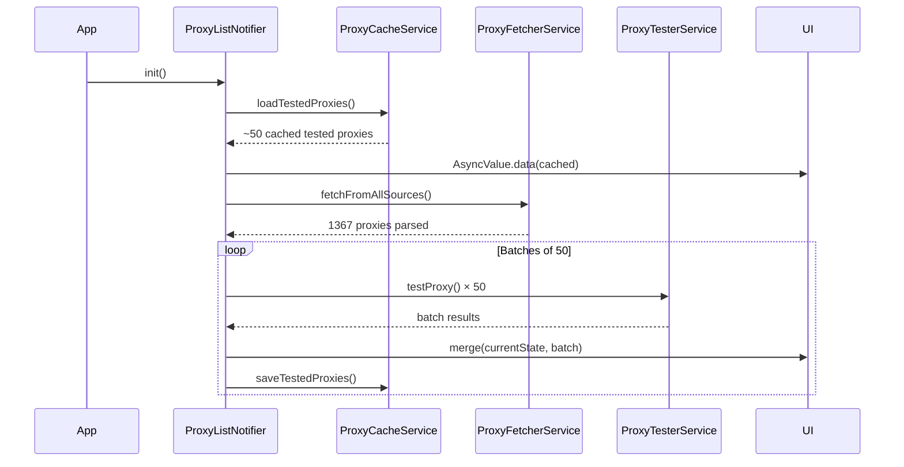

# TelePulse

[](LICENSE)
[](https://flutter.dev)
[](https://flutter.dev)
[](https://telegram.org)

MTProto proxy discovery engine for Android. Fetches, validates, and ranks Telegram proxies across 7 distributed sources. Bypasses IP-level network restrictions using local `tg://` intents — no web intermediates, no central server.

## Why TelePulse?

Telegram provides proxy *configuration* — you supply a `server:port:secret` and it attempts to connect. TelePulse provides the *supply chain* — automatic discovery, validation, and ranking of working proxies.

| Capability | Telegram Built-in | TelePulse |
|---|---|---|
| Proxy discovery | Manual entry required | Auto-fetches 1367+ from 7 sources |
| Pre-connection validation | Blind apply | TCP connect + TLS handshake verify |
| Ranking | Chronological | Latency, port-443, source trust |
| Multi-source aggregation | 5 manual slots max | 7 primary + 2 fallback + custom URLs |
| Favorites persistence | None | SharedPreferences bookmarking |
| Cache strategy | None | <100ms cache load, background merge |
| Network-aware | Manual re-check | Auto re-test on connectivity change |
| Concurrent testing | Sequential | 50 parallel sockets, incremental results |
| Link sharing | Manual copy | Long-press clipboard copy |

**Core use case**: When Telegram is inaccessible at the network level, you need a working proxy *before* you can open the app to configure one. TelePulse breaks this circular dependency — an independent Android client that discovers, validates, and delivers a pre-configured proxy to Telegram via a local `tg://` intent.

## Architecture Overview

```
┌──────────────────────────────────────────────────┐
│                   TelePulse                       │
├──────────────────────────────────────────────────┤
│  ┌────────────────────────────────────────┐       │
│  │          UI Layer (Riverpod)           │       │
│  │  Home ── ProxyList ── Favorites ── S.  │       │
│  └──────────────────┬─────────────────────┘       │
│                     │ state                        │
│  ┌──────────────────▼─────────────────────┐       │
│  │    ProxyListNotifier (StateNotifier)   │       │
│  │  - AsyncValue<List<ProxyModel>> state  │       │
│  │  - ProxyLoadState FSM                  │       │
│  │  - Cache-first merge logic             │       │
│  └──────────────────┬─────────────────────┘       │
│                     │                              │
│  ┌──────────────────▼─────────────────────┐       │
│  │           Service Layer                │       │
│  │  Fetch ── Test ── Rank ── Cache        │       │
│  │  DeepLink ── Connectivity              │       │
│  └────────────────────────────────────────┘       │
└──────────────────────────────────────────────────┘
```

## Data Flow



## Quick Start

```bash
git clone https://github.com/krsnaSuraj/TelePulse.git
cd TelePulse
flutter pub get
flutter build apk --debug
flutter install
```

On first launch, the app fetches all sources in parallel, tests every proxy at 50 concurrency, and displays results incrementally as batches complete.

## Proxy Sources

| Source | Type | Weight | Endpoint |
|---|---|---|---|
| SoliSpirit | Primary | 5 | GitHub raw `SoliSpirit/mtproto` |
| kort0881-all | Primary | 5 | GitHub raw `kort0881/proxy_all.txt` |
| kort0881-eu | Primary | 4 | GitHub raw `kort0881/proxy_eu.txt` |
| kort0881-ru | Primary | 4 | GitHub raw `kort0881/proxy_ru.txt` |
| Grim1313 | Primary | 5 | GitHub raw `Grim1313/all_proxies.txt` |
| iwh3n | Primary | 3 | GitHub raw `iwh3n/All_Proxys.txt` |
| ALIILAPRO | Primary | 3 | GitHub raw `ALIILAPRO/mtproto.txt` |
| SoliSpirit-mirror | Fallback | 2 | jsDelivr CDN mirror |
| Grim1313-HTML | Fallback | 2 | GitHub raw HTML parser |

Sources auto-disable after 3 consecutive failures with a 30-minute recovery window.

## Technical Stack

| Component | Choice | Rationale |
|---|---|---|
| Framework | Flutter 3.12+ / Dart 3.12 | Single codebase, native ARM64 |
| State | Riverpod 2.6 (StateNotifier) | Zero code-gen, testable, composable |
| HTTP fetch | Dio 5.9 | Retry, timeout, interceptor support |
| Proxy test | `dart:io` Socket | Direct TCP; no HTTP overhead, offline-capable |
| Cache | SharedPreferences | JSON serialization; no SQLite dependency |
| Deep link | `url_launcher` + `tg://` intent | Direct resolution; no `canLaunchUrl` flakiness |
| Monitoring | `connectivity_plus` | Cross-platform offline/online detection |

## Performance Budget

| Phase | Latency | Notes |
|---|---|---|
| Cache load (tested) | ~50ms | 50 proxies from SharedPreferences |
| Full fetch | 5-10s | 7 parallel HTTP requests |
| Full test | ~55s | 1367 × 2s timeout ÷ 50 concurrency |
| Incremental update | every ~2s | Per-batch merge to UI |

## License

MIT — see [LICENSE](LICENSE)
