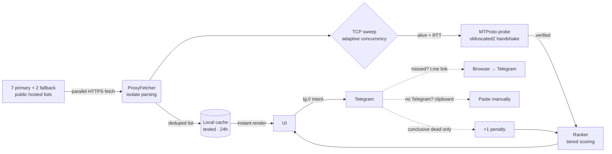
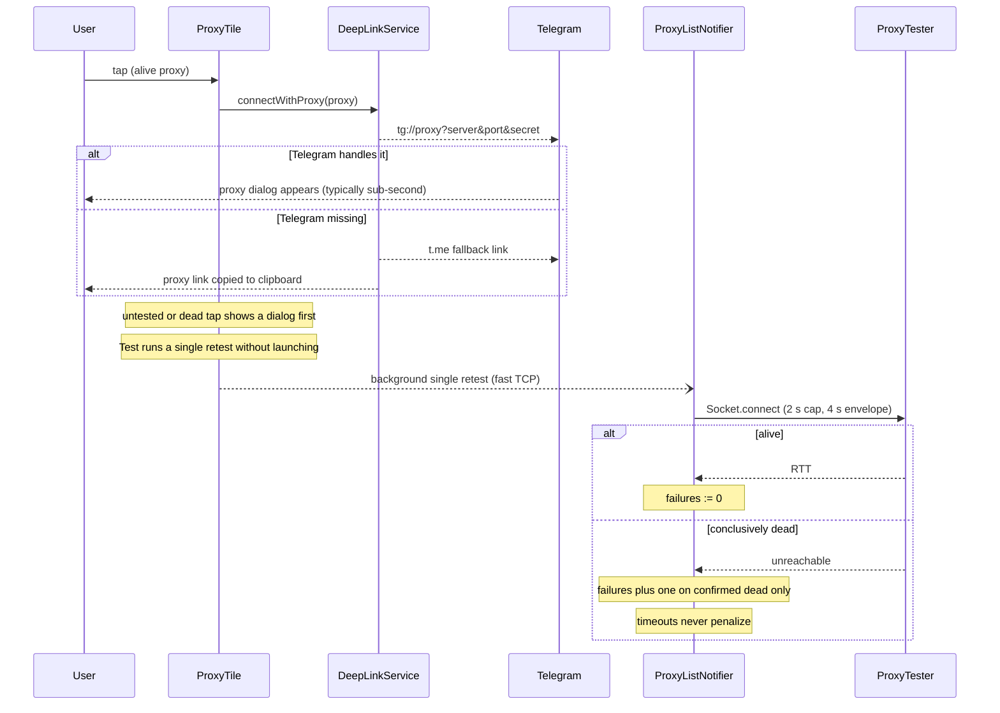
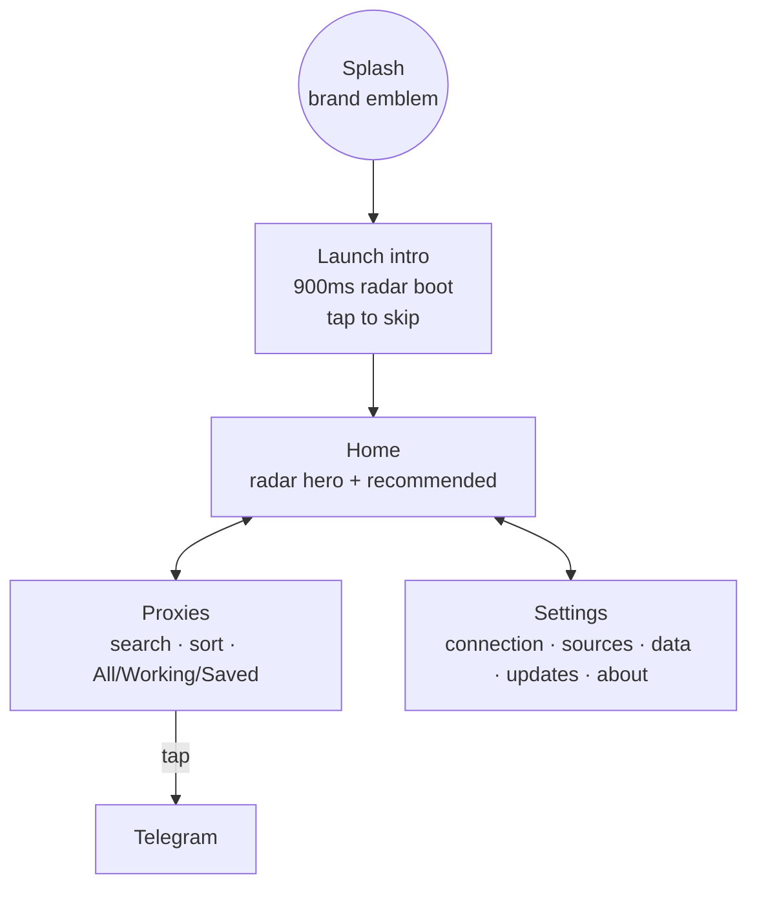

# TelePulse

<p align="center">
  
</p>

<h3 align="center">Find signal anywhere.</h3>

<p align="center">
  MTProto proxy discovery engine for Telegram — proxies that <em>provably</em> work.
</p>

<p align="center">
  
  
  
  
  
  
</p>

> **MTProto proxy discovery engine for Telegram.** When Telegram is blocked at the IP level, TelePulse finds proxies that *provably* work — TCP-validated, then MTProto-handshake-verified — and hands the best one to Telegram in one tap. No VPN. No manual entry. No central server of ours.

---

## The problem it solves

```
┌────────────────────────────────────────────────────────────┐
│                     THE BOOTSTRAP PROBLEM                  │
├────────────────────────────────────────────────────────────┤
│                                                            │
│  1. Your ISP blocks Telegram's IPs                         │
│  2. Telegram shows "Connecting…" forever                   │
│  3. To fix it you need a proxy                             │
│  4. But proxy lists live… inside blocked channels/sites    │
│                                                            │
│  TelePulse breaks the loop (step 4):                       │
│  • Fetches proxy lists from independent GitHub sources     │
│  • TCP-validates every proxy in parallel                   │
│  • MTProto-handshake-verifies survivors (req_pq → resPQ)   │
│  • Ranks them and hands the winner to Telegram             │
│                                                            │
│  One tap → Telegram opens with a working proxy.            │
│                                                            │
└────────────────────────────────────────────────────────────┘
```

TelePulse never routes your traffic itself — it is pure *discovery*. Telegram remains the consumer:


```mermaid
flowchart LR
    A[7 primary + 2 fallback<br/>public hosted lists] -->|parallel HTTPS fetch| B(ProxyFetcher<br/>isolate parsing)
    B -->|deduped list| C[(Local cache<br/>tested · 24h)]
    C -->|instant render| D[UI]
    B --> E{TCP sweep<br/>adaptive concurrency}
    E -->|alive + RTT| F[MTProto probe<br/>obfuscated2 handshake]
    F -->|verified| G[Ranker<br/>tiered scoring]
    G --> D
    D -->|tg:// intent| H[Telegram]
    H -.->|missed? t.me link| I[Browser → Telegram]
    H -.->|no Telegram? clipboard| J[Paste manually]
    H -.->|conclusive dead only| K["+1 penalty"]
    K --> G
```

## Features

| | Feature | How it works |
|---|---|---|
| ✅ | **Handshake-verified proxies** | Stage-2 probe performs a real obfuscated2 + `req_pq` handshake; only relays that answer `resPQ` earn the ✓ badge and tier 3 |
| ⚡ | **Gated instant connect** | Tapping an alive proxy fires `tg://` immediately; tapping an untested/dead proxy asks first (Test / Connect anyway) so Telegram never hangs on "Connecting…" — validation re-runs afterwards in the background |
| 🔎 | **Multi-source discovery** | 7 curated GitHub lists + CDN mirror + HTML fallback, fetched in parallel with per-source health tracking |
| 🧪 | **Parallel TCP validation** | 50-way on Wi-Fi/Ethernet, 12-way on mobile/VPN/other; jittered + shuffled socket opens |
| 🏆 | **Honest ranking** | Verified > alive > untested > dead; latency tiers, source trust, FakeTLS bonus, confirmed-only penalties |
| 🛡️ | **Hardened inputs** | HTTPS-only sources with per-hop redirect vetting, IP-literal private targets rejected at ingestion, hostnames vetted at connect time against resolved addresses, response caps, per-line parser isolation |
| 📴 | **Offline-first** | Cache-first rendering, stale-cache fallback with visible banners, Wi-Fi-only + auto-scan toggles, scans resume when stable |
| ⭐ | **Favorites that stick** | Persisted independently; survive refreshes even if the proxy disappears upstream |
| 🕵️ | **Privacy by omission** | No analytics, no accounts, no telemetry, cloud backup disabled; `INTERNET` + merged `ACCESS_NETWORK_STATE` (connectivity detection) only; caches expire (24h/1h, 7-day stale cap) — see [PRIVACY.md](PRIVACY.md) |

## Quick start

```bash
git clone https://github.com/krsnaSuraj/TelePulse.git
cd TelePulse
flutter pub get

# Debug build works out-of-the-box for contributors:
flutter run

# Release build (uses your android/key.properties if present):
flutter build apk --release --obfuscate --split-debug-info=debug-info
```

> **Contributors:** you do *not* need `key.properties` for local builds — a missing keystore falls back to the debug key with an explicit Gradle warning. **CI is fail-closed:** release builds on CI throw instead of signing with the debug key. **Do not distribute a debug-signed artifact.**

### Run the test suite

```bash
flutter analyze   # zero issues expected
flutter test      # 282 tests across 25 suites: errors, model, parser,
                  # host filter, ranker, cache, update, probe, notifier,
                  # concurrency, guards, view, sources, widgets, motion,
                  # security regression, cache integrity
```

## How a tap flows


```mermaid
sequenceDiagram
    participant U as User
    participant T as ProxyTile
    participant DL as DeepLinkService
    participant TG as Telegram
    participant N as ProxyListNotifier
    participant TS as ProxyTester

    U->>T: tap (alive proxy)
    T->>DL: connectWithProxy(proxy)
    DL-->>TG: tg://proxy?server&port&secret
    alt Telegram handles it
        TG-->>U: proxy dialog appears (typically sub-second)
    else Telegram missing
        DL-->>TG: t.me fallback link
        DL-->>U: proxy link copied to clipboard
    end
    Note over T: untested or dead tap shows a dialog first
    Note over T: Test runs a single retest without launching
    T--)N: background single retest (fast TCP)
    N->>TS: Socket.connect (2 s cap, 4 s envelope)
    alt alive
        TS-->>N: RTT
        Note over N: failures := 0
    else conclusively dead
        TS-->>N: unreachable
        Note over N: failures plus one on confirmed dead only
        Note over N: timeouts never penalize
    end
```

Failure penalties are applied **only after a conclusive failed test**. Background sweeps preserve the counter; timeouts and exploration never punish a proxy. The two-tier policy is pinned by tests.

## Two-stage validation

```
Stage 1 — TCP sweep (all fetched proxies)
  Socket.connect ≤ 2 s · 4 s envelope · staggered + shuffled
  └── proves: something answers on that port

Stage 2 — MTProto probe (TCP-alive, fastest-first, max 40/sweep)
  obfuscated2 init (AES-256-CTR, proxy-secret keys) → padded-intermediate
  req_pq_multi → valid resPQ with echoed nonce?
  └── proves: a real Telegram relay behind THIS secret (max 40/sweep, 10 on metered)

  ✓ verified  →  tier 3, floats to Recommended now
   TCP-alive   →  tier 2 (FakeTLS ee… stays here — its handshake disguise
                  differs and is not probed)
```

## Ranking model

Sort order is strictly tiered, then scored:

```
tier 3  verified alive ┐
tier 2  TCP alive       ├─ within a tier: score desc, latency asc, key asc
tier 1  untested        │
tier 0  confirmed-dead  ┘

score = 100                (alive)
      + latency tier       (<100ms:+50 <300:+40 <500:+25 <1000:+10)
      + source trust       (weight × 2 → 4…10 known sources, 0 unknown)
      + FakeTLS secret ee  (+15 once handshake-verified; ee… is not yet
                            verifiable, so it competes on latency/trust) | dd (+5)
      + port 443           (+8)
      − 50 × failures      (clamped at 10)

Protocol prefixes match lowercase `ee`/`dd`; uppercase variants ingest fine (hex) but earn no bonus.
```

Proxies with ≥ 3 confirmed failures drop out of *Recommended now* until a later successful test clears them.

## Source inventory

| Group | Name | Weight | Format |
|---|---|---|---|
| Primary | SoliSpirit | 5 | auto |
| Primary | kort0881-all / -eu / -ru | 5 / 4 / 4 | auto |
| Primary | Grim1313 | 5 | auto |
| Primary | iwh3n | 3 | auto |
| Primary | ALIILAPRO | 3 | auto |
| Fallback | SoliSpirit-mirror (jsDelivr) | 2 | auto |
| Fallback | Grim1313-HTML | 2 | html |

Sources auto-disable after 3 consecutive failures and recover after 30 minutes. Custom HTTPS sources you add persist across restarts. Secrets must be hex (16–128 chars) on every parse path; localhost/private targets are rejected at ingestion.

## App tour


```mermaid
flowchart TD
    S((Splash<br/>brand emblem)) --> I[Launch intro<br/>900ms radar boot<br/>tap to skip]
    I --> H[Home<br/>radar hero + recommended]
    H <--> P[Proxies<br/>search · sort · All/Working/Saved]
    H <--> ST[Settings<br/>connection · sources · data · updates · about]
    P -->|tap| TG[Telegram]
```

- **Home** — live radar plotting every known proxy, recommended picks with verified badges, honest scan progress.
- **Proxies** — the full list with search, four sort orders, and All/Working/Saved segments.
- **Settings** — auto-scan + Wi-Fi-only toggles, custom sources, built-in registry with trust dots, storage stats, update checks, and an about card with open-source + privacy rows.

## Security & threat model (honest version)

TelePulse improves your **availability**, not your anonymity:

- **Proxy operators can see that you use Telegram** and observe traffic metadata — they see your IP once you connect through them. Use sources you trust; TelePulse marks sources by track record, never as "verified".
- TCP validation proves reachability, **not trustworthiness** — which is exactly why the stage-2 handshake probe exists. FakeTLS (`ee…`) proxies cannot be handshake-verified yet and stay TCP-tier; this limitation is stated, not hidden.
- The app blocks connections to loopback/private/link-local/CGNAT/TEST-NET/documentation addresses so a malicious list cannot use your device to probe your LAN — and connects to vetted resolved addresses, never re-resolving by hostname.
- Cloud backup & device-transfer of app data are disabled — favorited proxies never leave your phone.
- Updates resolve only against GitHub-owned domains over HTTPS, with repo-path checks on release pages and re-validation of cached payloads.
- Permissions are `INTERNET` (declared) + `ACCESS_NETWORK_STATE` (merged from `connectivity_plus` for Wi-Fi/mobile detection; read-only status, no location).
- Retention: tested cache fresh 24h with up to 7-day stale fallback, fetched cache 1h, update check 1h; favorites/sources/settings persist until deleted. Wipe everything via Android Settings → Apps → TelePulse → Storage → Clear data, or `ProxyCacheService.deleteAllData()` (all `tp_v2_*` keys); `clear()` removes caches only.

Data handling: [PRIVACY.md](PRIVACY.md)

## Project layout

```
lib/
├── main.dart                  # AppMeta init → ProviderScope
├── app.dart                   # launch intro → flush-on-background → 3-tab shell
├── core/                      # constants, app meta, theme, errors, formatters, haptics
├── data/proxy_sources.dart    # source registry (weight drives trust score)
├── models/
│   ├── proxy_model.dart       # immutable proxy + protocol detection + verified flag
│   └── proxy_view.dart        # filter/sort/view pure functions
├── providers/                 # reactive FSM (single observable state object)
├── screens/                   # home radar, proxies (search/sort/filters), settings
├── services/
│   ├── proxy_parser.dart      # pure, isolate-safe line/HTML parsing
│   ├── host_filter.dart       # IPv4/IPv6 private-range guard
│   ├── proxy_fetcher_service.dart   # HTTPS walk, caps, cancel tokens
│   ├── proxy_tester_service.dart    # adaptive-concurrency TCP probe
│   ├── mtproto_probe_service.dart   # obfuscated2 handshake verification
│   ├── proxy_ranker_service.dart
│   ├── proxy_cache_service.dart     # debounced, capped, generation-guarded
│   ├── proxy_source_provider.dart   # health tracking + backoff
│   ├── connectivity_service.dart    # 5 s stability window
│   ├── deep_link_service.dart
│   └── update_service.dart    # two-tier trust (host + repo path)
└── widgets/                   # radar, tiles, badges, orb, banners, brand, intro…
```

More depth in [ARCHITECTURE.md](ARCHITECTURE.md).

## License

MIT — see [LICENSE](LICENSE).


